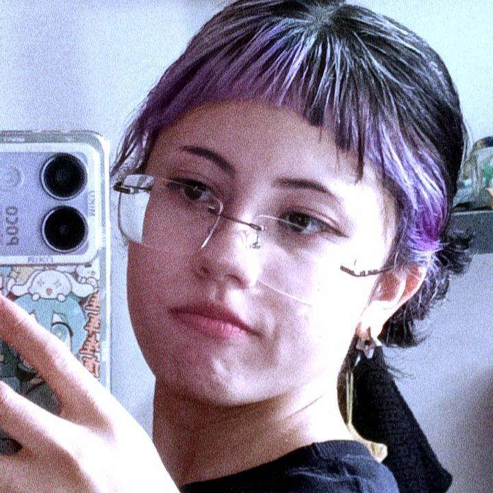

<h1 align="center" style="color:#b366ff;">✨ Portfólio - Le &lt;4 ✨</h1>

  

  <b>🌈 Projeto desenvolvido inicialmente para uma lição do professor Alê, mas que acabou virando algo especial!</b> 
  Gostei tanto do resultado que resolvi isolar ele em um repositório próprio 💜 
  O design representa muito minha essência — e claro, traz a minha main do Genshin Impact, a <b>Yumemizuki</b> :3

---

## 💻 Visualização

🔗 **Veja o projeto online:**  
👉 [Visualize aqui](https://lelolel.github.io/first-portfolio)

---

## 🎨 Sobre o projeto

Esse portfólio foi criado com o intuito de explorar:
- 🌸 **HTML semântico**
- 💜 **CSS criativo com foco em identidade visual**
- 💫 **JavaScript básico para interatividade**

O resultado é um site que mistura tecnologia e arte — uma vitrine das minhas paixões e aprendizados.

---

## 💕 Tecnologias usadas

| Linguagem | Função |
|------------|--------|
| 🩵 **HTML5** | Estrutura da página |
| 💜 **CSS3** | Estilo e animações |
| 🌸 **JavaScript** | Interatividade |

---

## 🌷 Créditos

Desenvolvido com carinho por **Le &lt;4**  
Feito com inspiração, chá de pêssego, e uma boa trilha sonora de Genshin (inclusive, ouçam https://music.youtube.com/watch?v=5vGHAA7-f8M&si=FpZRjjUqGwwVf7E_) 🎧🎵  

---

  💫 <i>“Trazer vida e autenticidade em arte e código.”</i> 💫

